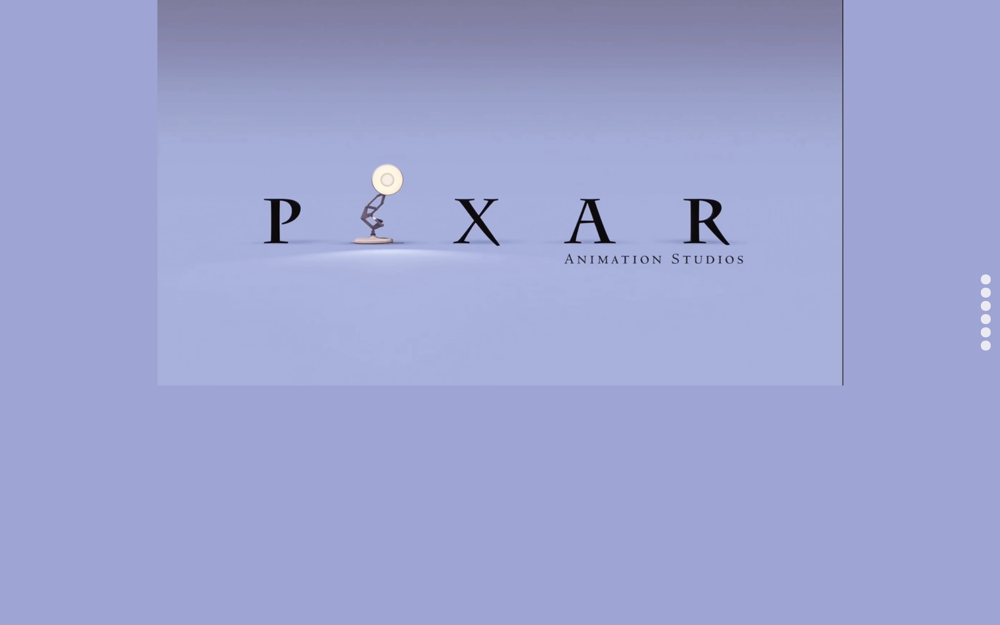

# zero-cup-2021-bug永远改不队
## 一、主要内容
1. History：以时间轴的方式展示了Pixar动画工作室从成立至今的历史和主要的代表作品，让访问者对Pixar的发展历程有一个全面的了解。
2. Films：这个部分我们通过轮播图展示了Pixar动画电影中一些经典的系列作品，并插入了一些视频，让访问者能直观地感受Pixar动画电影的魅力。
3. Characters：在这里我们以类似舞台的形式展示了六个Pixar动画电影中家喻户晓的角色，点击会播放角色的经典台词和展示角色的细节信息。
4. Prizes：我们用类似镜头快门打开关闭的方式展示Pixar的一些电影获得的奖项。
##二、项目目录及说明
```txt
.
├── FirstPage
│   ├── game.css //小游戏样式文件
│   ├── index.css //主页样式文件
│   ├── timeline.css //时间轴样式文件
│   └── waterfallflow.css //名人堂样式文件
├── game.html //小游戏网页入口
├── index.html //主页入口
├── javascript
│   ├── DecisionTree.js //小游戏贪心算法接口
│   ├── index.js //主页js文件
│   ├── jquery-1.10.2.js //jQuery库，下同
│   ├── jquery-3.5.1.min.js
│   ├── swiper // swiper.js库
│   │   └── dist
│   │       ├── css
│   │       │   ├── swiper.css
│   │       │   └── swiper.min.css
│   │       └── js
│   │           ├── swiper.esm.bundle.js
│   │           └── ...
│   └── timeline.js //时间轴js文件
├── README.md //说明文档
├── README.pdf //说明文档pdf版本
├── source
│   ├── font //字体
│   │   ├── HYShangWeiShouShuW.ttf
│   │   └── SourceHanSansCN-1.000
│   │       ├── SourceHanSansCN-Bold.otf
│   │       └── ...
│   ├── icon // 图标
│   │   ├── award.png
│   │   └── ...
│   ├── img //图片资源
│   │   ├── Clearlove.png
│   │   ├── down.svg
│   │   ├── Edg.png
│   │   ├── ...
│   │   ├── game
│   │   │   ├── 1.jpg
│   │   │   └── ...
│   │   ├── no
│   │   │   ├── 1.png
│   │   │   └── ...
│   │   ├── timeline
│   │   │   ├── 1.jpg
│   │   │   └── ...
│   │   ├── yes
│   │   │   ├── 1.png
│   │   │   └── ...
│   │   └── ...
│   └── video
│       ├── LOLOurGame.mp4
│       └── LOLWORLDFINALS.mp4
├── timeline.html //时间轴入口
└── waterfallflow.html //名人堂入口

```


### 第一部分：标题

我们首先通过渐入"Are you ready to know about Pixar?"做了一个引入，使读者对接下来我们将要展示的内容有一定的了解。


为了使一些看过甚至熟知Pixar动画的访问者获得一些熟悉感和亲近感，以及使一些没有接触过Pixar动画的访问者对我们的网页产生一定兴趣，在接下来的部分我们采用了一段Pixar经典的开场动画来过渡到正式的开场部分，同时这也是我们对Pixar的制作者的一种致敬。



继续下滑则会显示出。


这个过渡动画是的灵感来自于iPhone 13 Pro 介绍网页中1TB部分的动画。

### 第二部分：历史

这个部分主要介绍了Pixar的历史，页面是左右排布的。

### 第三部分：电影

这个部分通过轮播图的方式展示了一些Pixar的电影/系列电影。

点击图片则会开始播放一些B站找到的视频混剪。

这里我们对背景进行了毛玻璃的处理。


### 第四部分：人物

这个部分介绍了六个Pixar的经典角色


点击图片则会打开显示具体的人物介绍，并且播放人物的台词。


同样的，我们也对背景进行了毛玻璃处理。

### 第五部分：奖项

这个部分是介绍一些Pixar电影所获的的荣誉


点击相应的电影图片便会通过相机快门开关的动画显示该电影所得奖项


### 第六部分：结尾

这个部分是对于Pixar的一些评价


